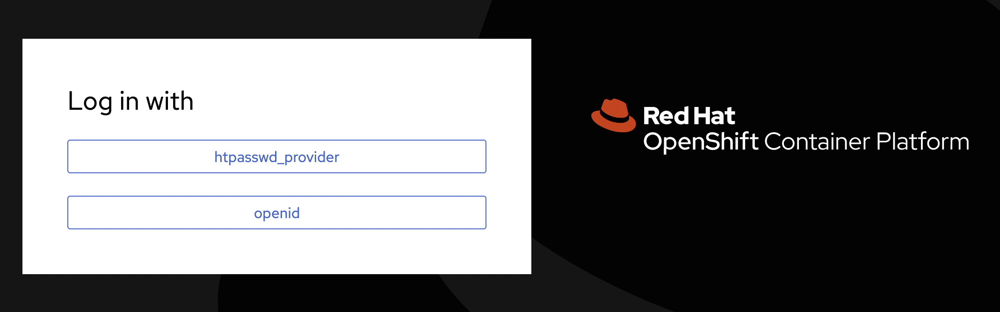

# Customize OpenShift Login Screen with USG Banner

OpenShift has 3 customizable login pages:

* Login - Page for username/password entry (Used for htpasswd and kube:admin login)
* Providers - Page shows a list of available authentication providers
* Error - Page shows when a login error occurs

This repo contains code to customize the Login and Providers pages with the
United States Government (USG) consent banner required on USG owned information
systems. [Reference](https://www.stigviewer.com/stig/red_hat_enterprise_linux_7/2017-12-14/finding/V-72225).

## Screenshots

### Login Page


### Providers Page



## How to Deploy

Log in to the OpenShift cluster on the command line with `oc`. Then run,

```bash
./deploy.sh
```

## How to Delete

Log in to the OpenShift cluster on the command line with `oc`. Then run,

```bash
./delete.sh
```
