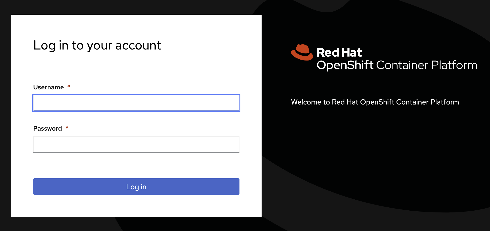
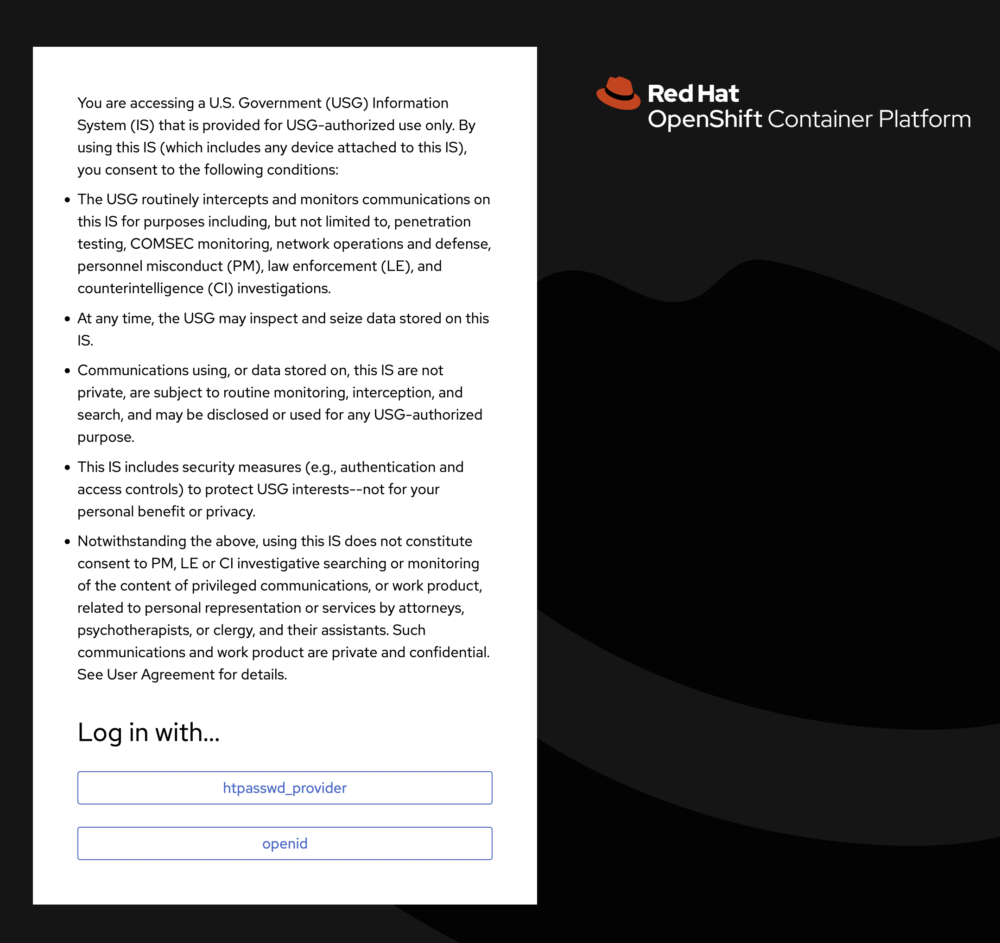
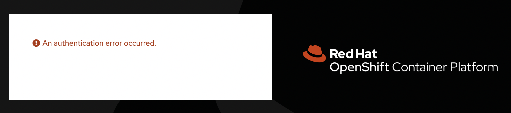
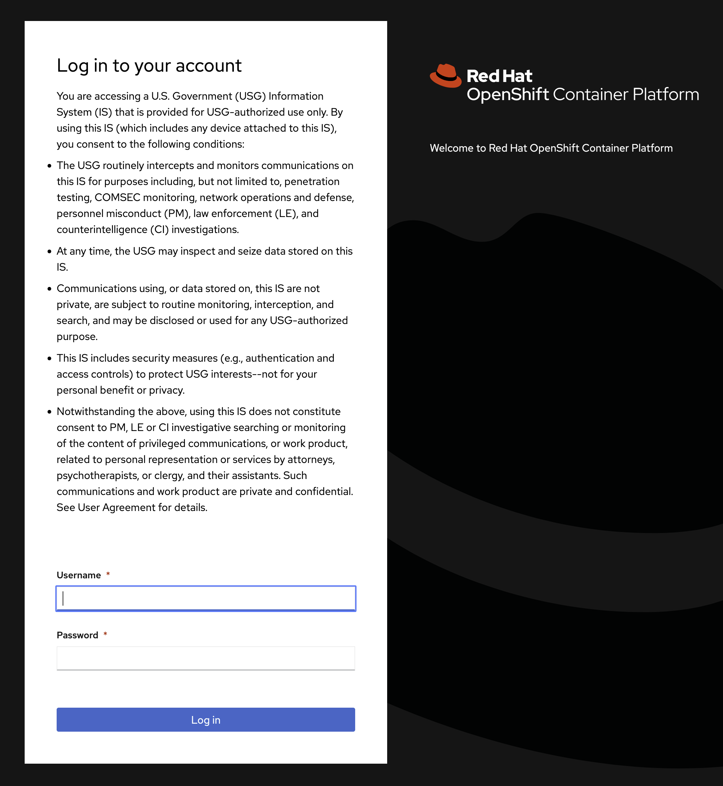
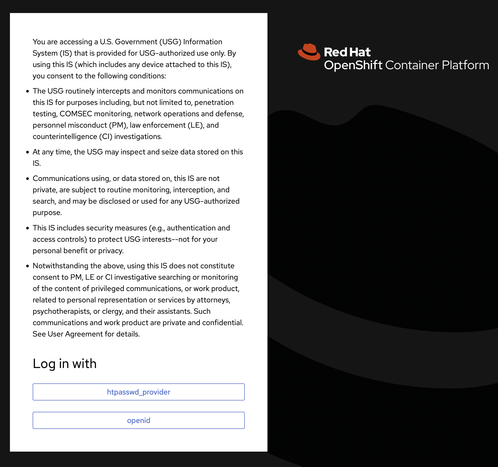

# Custom OpenShift Login Page with USG Banner

OpenShift allows for customization of the login to meet a customer's requirements.
One requirement for United States Government customers is to display a legal acknowledgment to users before they sign in. ([USG Banner Reference])

This post details how to customize the OpenShift login pages.

As a user goes through the OpenShift authentication process, there are three distinct pages that could be displayed.

### Login (`login.html`)



This page contains the username/password form used for htpasswd and kube:admin authentication.

### Providers (`providers.html`)



This page contains a list of available authentication providers.
It is used when more than one authentication provider is configured in OpenShift.

### Error (`error.html`)



This page is displayed when an authentication error occurs.
For this use case it's not necessary to customize the error page.

## Configuration

Depending on how authentication is configured for a given cluster, both the login and providers pages may need to be customized to show the acknowledgment.
It doesn't hurt to customize both even if one of those two pages is never shown to a user.

The OpenShift documentation details the process to customize the login screen under the [Customizing the login page] section.
The process from the docs starts with bare, unstyled pages for login, providers, and error.

Unless your organization has a specific theme to apply, it's easier to grab the default theme OpenShift uses and customize that.
From a running OpenShift cluster, it's possible to pull the code used for the default theme.

```bash
POD=$(oc get pods -n openshift-authentication -o name | head -n 1)

oc exec -n openshift-authentication "$POD" -- cat /var/config/system/secrets/v4-0-config-system-ocp-branding-template/providers.html > providers.html

oc exec -n openshift-authentication "$POD" -- cat /var/config/system/secrets/v4-0-config-system-ocp-branding-template/login.html > login.html
```

Edit both documents, login.html and providers.html. In the body, under the `<div class="pf-c-login__main-body">` tag, add:

```html
<p>
    You are accessing a U.S. Government (USG) Information System (IS) that is provided for USG-authorized use only. By using this IS (which includes any device attached to this IS), you consent to the following conditions:
</p>
<ul style="list-style-type: disc; margin-bottom: 2em;">
    <li style="margin: .5em 0;">The USG routinely intercepts and monitors communications on this IS for purposes including, but not limited to, penetration testing, COMSEC monitoring, network operations and defense, personnel misconduct (PM), law enforcement (LE), and counterintelligence (CI) investigations.</li>
    <li style="margin: .5em 0;">At any time, the USG may inspect and seize data stored on this IS.</li>
    <li style="margin: .5em 0;">Communications using, or data stored on, this IS are not private, are subject to routine monitoring, interception, and search, and may be disclosed or used for any USG-authorized purpose.</li>
    <li style="margin: .5em 0;">This IS includes security measures (e.g., authentication and access controls) to protect USG interests--not for your personal benefit or privacy.</li>
    <li style="margin: .5em 0;">Notwithstanding the above, using this IS does not constitute consent to PM, LE or CI investigative searching or monitoring of the content of privileged communications, or work product, related to personal representation or services by attorneys, psychotherapists, or clergy, and their assistants. Such communications and work product are private and confidential. See User Agreement for details.</li>
</ul>
```

Save the changes to both documents.

To apply the customizations to OpenShift, each document needs to be put into a secret in the *openshift-config* namespace.

```bash
oc create secret generic login-template --from-file=login.html -n openshift-config

oc create secret generic providers-template --from-file=providers.html -n openshift-config
```

Finally, patch the *oauth/cluster* object to tell OpenShift use the new templates.

```bash
oc patch oauths cluster --type=json -p='[ { "op": "add", "path": "/spec/templates", "value": { "providerSelection": { "name": "providers-template" }, "login": { "name": "login-template" } } } ]'
```

Patching the oauth/cluster object will cause the authentication cluster operator to deploy new pods into the *openshift-authentication* namespace.
This rollout brings down the pods one at a time so it may take several minutes for the rollout to complete.
You can monitor the cluster operator progress with:

```bash
oc get co
```

(`co` is short for clusteroperator)

Once the operator reports back *"Ready"*, log out of OpenShift, and navigate back to the login screen.

It should look like this if only one authentication provider (kube:admin or htpasswd) is configured:



It should look like this if multiple authentication providers are configured:



## Bonus: Customize the Login Page Across a Multi-Cluster Fleet

This customization can be deployed through Advanced Cluster Management (ACM) for Kubernetes.
Using *Governance Policy* in ACM, an OpenShift administrator can configure login customizations once, then deploy to all clusters.

The policy object is lengthy, so I won't post it inline. Instead, check out the policy code [here](link)!

[Customizing the login page]: https://docs.openshift.com/container-platform/4.11/web_console/customizing-the-web-console.html#customizing-the-login-page_customizing-web-console
[USG Banner Reference]: https://www.stigviewer.com/stig/red_hat_enterprise_linux_7/2017-12-14/finding/V-72225
