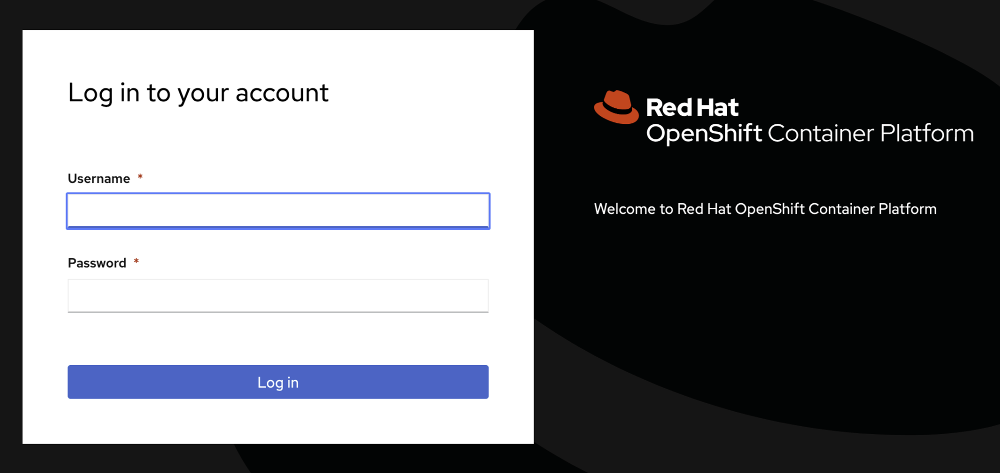
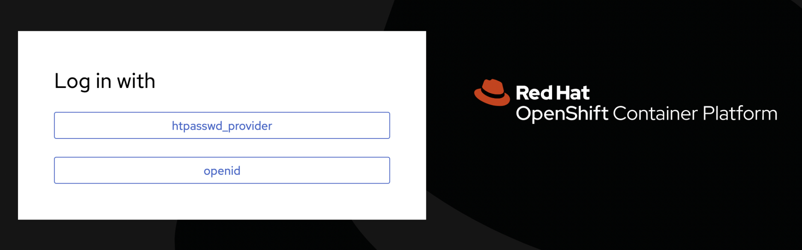
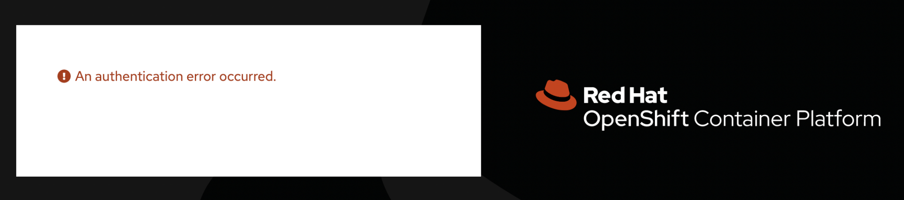
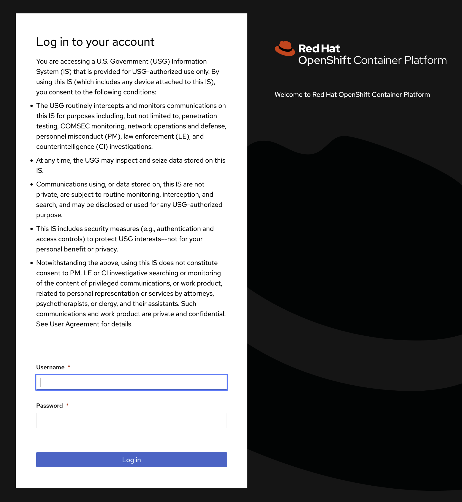
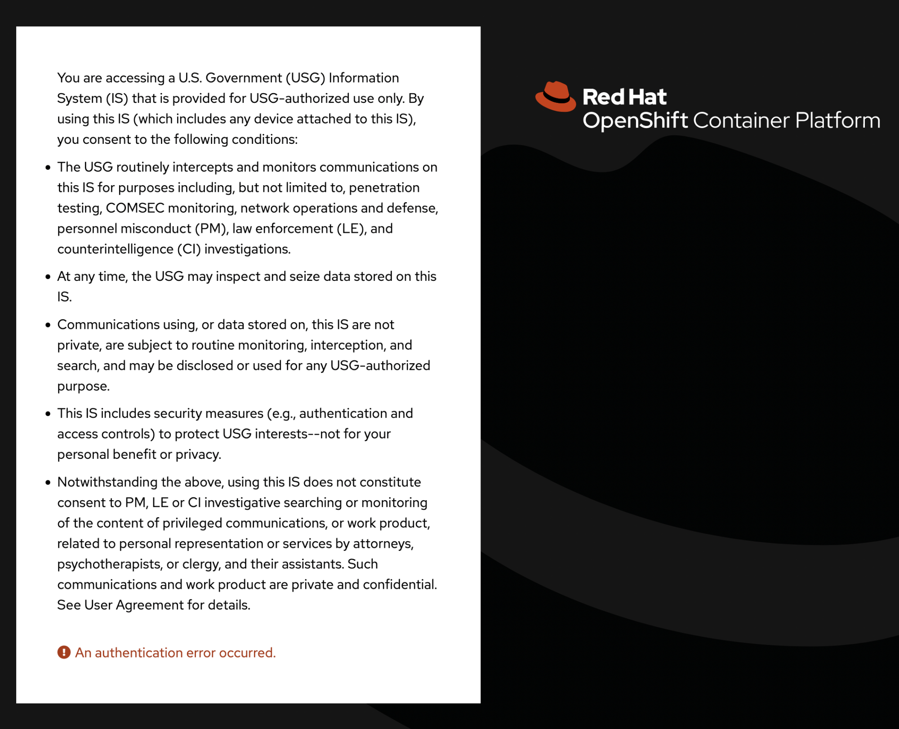
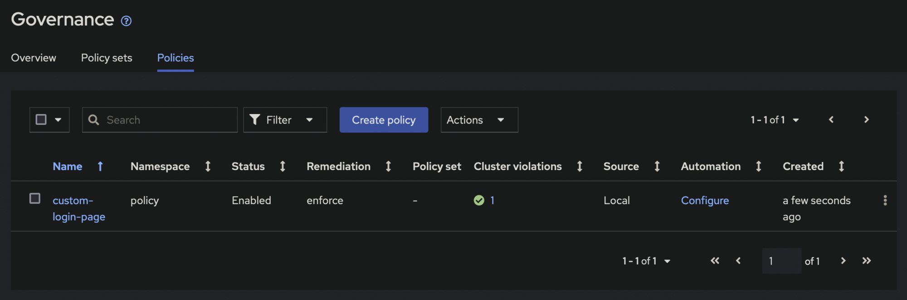

# Customize OpenShift Login with US Government Banner

Red Hat OpenShift allows for customization of the console login pages to meet customer requirements.
One requirement for United States Government (USG) customers is to display a legal acknowledgment to users before they are authenticated ([USG Banner Reference]).
This post steps through the process to customize OpenShift login pages with an acknowledgment.
Code from this post is available on GitHub [here][openshift-custom-gov-login].

OpenShift's login screen is comprised of 3 distinct pages: Login, Providers, and Error.

### Login (`login.html`)

The Login page contains the username/password form used for local authentication, such as htpasswd or kube:admin.
This is the page you see on a fresh cluster install when only kube:admin authentication is enabled.
If only one local authentication method is configured, this page will be displayed when an unauthenticated user attempts to access the console.



### Providers (`providers.html`)

The Providers page contains a list of available authentication providers.
It is only displayed when two or more authentication providers are configured in OpenShift.
If two or more authentication providers are configured, this page will be displayed when an unauthenticated user attempts to access the console.



### Error (`errors.html`)

The Error page is only displayed when authentication errors occur.



## Configuration

Depending on how cluster authentication is configured, both login and providers pages may need to be customized to show the acknowledgment.
It doesn't hurt to customize all three pages though, even if one of the pages is never shown to a user.

OpenShift documentation details the process to customize the login screen under [Customizing the login page].
This process from the docs starts with bare, unstyled pages for login, providers, and error.
Unless your organization has a specific theme to apply, it's easier to grab the default themed pages directly from the authentication pods.

Log into OpenShift on the command line with `oc` and run:

```bash
POD=$(oc get pods -n openshift-authentication -o name | head -n 1)

oc exec -n openshift-authentication "$POD" -- cat /var/config/system/secrets/v4-0-config-system-ocp-branding-template/errors.html > errors.html

oc exec -n openshift-authentication "$POD" -- cat /var/config/system/secrets/v4-0-config-system-ocp-branding-template/login.html > login.html

oc exec -n openshift-authentication "$POD" -- cat /var/config/system/secrets/v4-0-config-system-ocp-branding-template/providers.html > providers.html
```

Edit all three documents, *errors.html*, *login.html*, and *providers.html*. In the body of each document, under `<div class="pf-c-login__main-body">`, add:

```html
<p>
    You are accessing a U.S. Government (USG) Information System (IS) that is provided for USG-authorized use only. By using this IS (which includes any device attached to this IS), you consent to the following conditions:
</p>
<ul style="list-style-type: disc; margin-bottom: 2em;">
    <li style="margin: .5em 0;">The USG routinely intercepts and monitors communications on this IS for purposes including, but not limited to, penetration testing, COMSEC monitoring, network operations and defense, personnel misconduct (PM), law enforcement (LE), and counterintelligence (CI) investigations.</li>
    <li style="margin: .5em 0;">At any time, the USG may inspect and seize data stored on this IS.</li>
    <li style="margin: .5em 0;">Communications using, or data stored on, this IS are not private, are subject to routine monitoring, interception, and search, and may be disclosed or used for any USG-authorized purpose.</li>
    <li style="margin: .5em 0;">This IS includes security measures (e.g., authentication and access controls) to protect USG interests--not for your personal benefit or privacy.</li>
    <li style="margin: .5em 0;">Notwithstanding the above, using this IS does not constitute consent to PM, LE or CI investigative searching or monitoring of the content of privileged communications, or work product, related to personal representation or services by attorneys, psychotherapists, or clergy, and their assistants. Such communications and work product are private and confidential. See User Agreement for details.</li>
</ul>
```

Save the changes to all documents.

To apply the customizations to OpenShift, each document needs to be put into a secret in the *openshift-config* namespace.

```bash
oc create secret generic error-template --from-file=errors.html -n openshift-config

oc create secret generic login-template --from-file=login.html -n openshift-config

oc create secret generic providers-template --from-file=providers.html -n openshift-config
```

Finally, patch the *oauth/cluster* object to tell OpenShift to use the new templates.

```bash
oc patch oauths cluster --type=json -p='[ { "op": "add", "path": "/spec/templates", "value": { "error": { "name": "error-template" }, "providerSelection": { "name": "providers-template" }, "login": { "name": "login-template" } } } ]'
```

After the patch, `oc get oauth cluster -o yaml` should contain:

```yaml
spec:
  templates:
    error:
      name: error-template
    login:
      name: login-template
    providerSelection:
      name: providers-template
```

Patching the oauth/cluster object will cause the authentication cluster operator to deploy new pods into the *openshift-authentication* namespace.
This rollout brings down pods one at a time so it may take several minutes for the rollout to complete.
You can monitor the cluster operator progress with:

```bash
oc get co  # "co" is short for "clusteroperator"
```

Once the operator reports back *"Ready"*, log out of OpenShift and navigate back to the console.

It should redirect you to a login page that looks like this if only one authentication provider (kube:admin or htpasswd) is configured:



It should look like this if multiple authentication providers are configured:


The error page will look like this:



## Bonus: Customize the Login Page Across a Multi-Cluster Fleet

This customization can be deployed through [Red Hat Advanced Cluster Management (ACM) for Kubernetes].
Using *Governance Policy* in ACM, an OpenShift administrator can configure login customizations once, then deploy to all clusters.

The policy object is too lengthy to post inline.
Instead, grab [acm-policy.yaml] from GitHub.
This file contains templates of the three authentication pages, base64 encoded in secrets, and the *oauth/cluster* configuration.
The policy targets all available clusters, meaning each available cluster will have all 4 templates deployed to it.

To deploy, log in to the ACM hub cluster with `oc`, `cd` to the directory with *acm-policy.yaml*, and run:

```bash
oc create -f acm-policy.yaml
```

After deploying, check the status on the *Governance* page in the ACM web console.



The status on all clusters will briefly show as non-compliant.
Because the policy is set to enforce, within a few seconds, the policy will be pushed to all non-compliant clusters.

Once the template resources exist on a cluster, it will report back as compliant.
Note that, same as the manual configuration, it will take a few minutes for the authentication operator to roll out new pods even after ACM shows a cluster as compliant.

[Customizing the login page]: https://docs.openshift.com/container-platform/4.11/web_console/customizing-the-web-console.html#customizing-the-login-page_customizing-web-console
[Red Hat Advanced Cluster Management (ACM) for Kubernetes]: https://www.redhat.com/en/technologies/management/advanced-cluster-management
[USG Banner Reference]: https://www.stigviewer.com/stig/red_hat_enterprise_linux_7/2017-12-14/finding/V-72225
[acm-policy.yaml]: https://github.com/RyanMillerC/openshift-custom-gov-login/blob/main/acm/acm-policy.yaml
[openshift-custom-gov-login]: https://github.com/RyanMillerC/openshift-custom-gov-login
